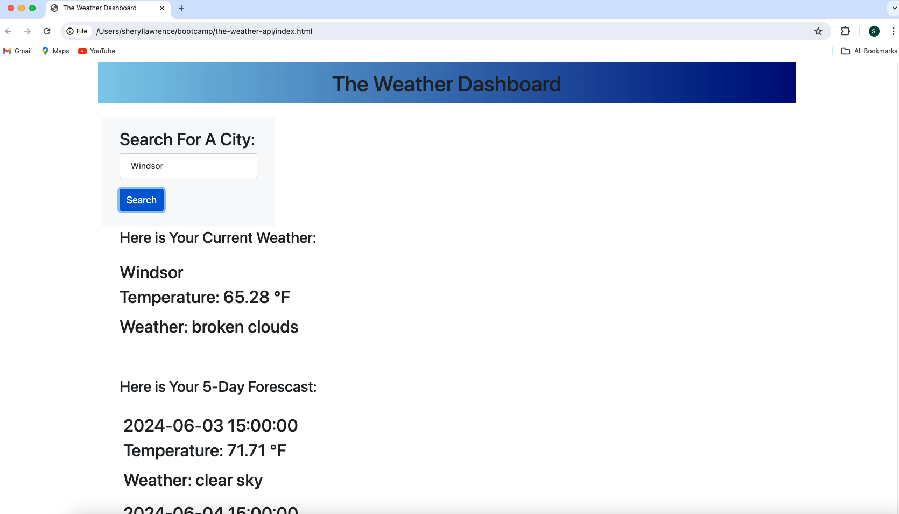
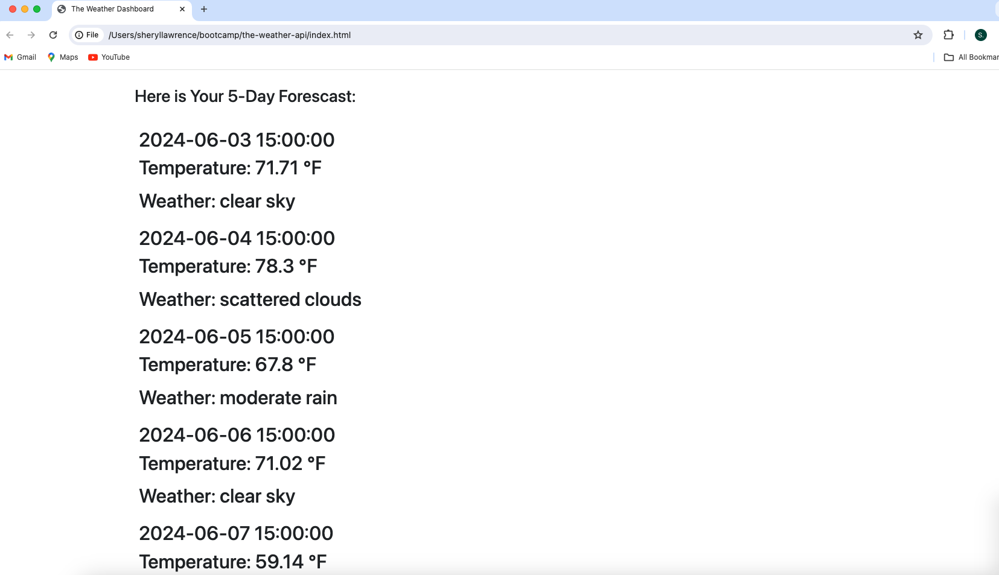

# the-weather-dashboard
A five day weather application 

## Description
- This is a weather dashboard allows users to search for a city and retrieve a five day forecast.
- The motivation for this project was to obtain a better understanding of implementing third-party API's. 
- This project utilizes JavaScript, local storage and the OpenWeather API and dynamically updated HTML and CSS. 
- One challenge that arose when making this project was with time and the code being time consuming to write. For example, HTML and CSS, while not difficult to write, can be time consuming, especially when trying to obtain a particular format and styling. 
- Another huge challenge was working with a new API and retreiving data from another application. Many errors came up initially with the API keys and API URL, but most were resolved using the websites documentation and through my console.log messages. 
- There was also confusion around how to get an API key and the API URL  which yields five days results after searching any city. After implementing the information provided from the OpenWeather website, debugging and getting the API functioning, my weather results, regardless of the city searched or no city being provided, was the current (only) weather for London. There were also issues around the accuracy of the temperature provided. 

## Usage
- This webpage can be accessed by placing the URL in a browser. The webpage does not require any authentications, for example, a password. 
- The user will type a city in the search bar, under the 'Search For A City' text, and click the 'Search' button.

- Screenshots of this application

- Live link for this application 
[x]https://slawcode.github.io/the-weather-dashboard/[y]

## License 
- There is no license for this project. 

## Credits 

Griffith, S. [Steve Griffith - Prof3ssorSt3v3]. (2021, August 31). OpenWeatherMap API Tutorial 2021 [Video]. YouTube. (https://www.youtube.com/watch?v=GJYMcLus3v0)

OpenWeather. (2024). https://openweathermap.org/api

Tigalo, J. (2022). About the Weather. GitHub [Source Code]. https://github.com/jbtiglao/about-the-weather.git

University of Toronto. (2023). Coding Boot Camp [Source Code].

